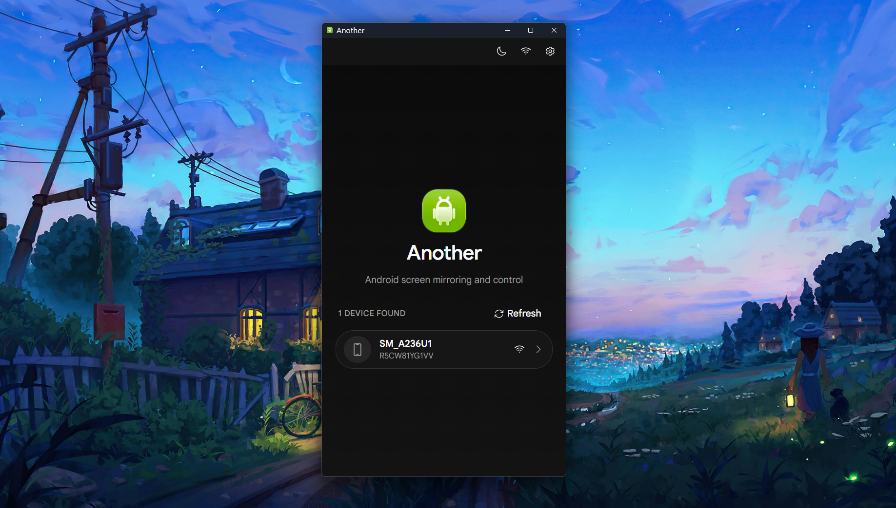

<p align="center">
  
</p>

<h1 align="center">AnotherAnother</h1>

<p align="center">A desktop app for mirroring and controlling Android devices. Built with Tauri, React, and Rust.</p>

> A fork of [Zfinix/another](https://github.com/Zfinix/another) focused on stability and keyboard-driven workflows.

**Key differences from the original:**

- **UI-first design** — Rebuilt with Tailwind CSS and shadcn/ui components
- **Multi-window architecture** — Each device runs in its own isolated window; if one crashes, others remain unaffected
- **Keyboard-centric** — All actions accessible via hotkeys
- **Reduced scope** — MCP/AI features removed for a leaner codebase
- **Fixed Windows CLI spam** — Terminal noise from ADB communication resolved



Uses a bundled [scrcpy-server](https://github.com/Genymobile/scrcpy) to stream video from the device and send control inputs back.

## Download

Download the latest release for your platform from the [Releases](https://github.com/ardevdevts/another/releases) page.

## Features

- Real-time screen mirroring via H.264/H.265 decoding
- Adaptive bitrate that responds to screen activity in real time
- Macros — record, replay, import, export, and rename device interactions
- Device nicknames — assign custom names to each device
- WiFi mirroring — connect wirelessly with one click
- Audio forwarding (Android 11+)
- Screen recording (WebM format)
- Input forwarding — touch, keyboard, scroll, and navigation buttons
- Command bar with keyboard shortcuts for all actions
- Configurable video quality — resolution, FPS, bitrate, and codec
- Screenshot capture
- Automatic device detection via ADB
- Light, dark, and auto themes

## Keyboard Shortcuts

| Shortcut    | Action                  |
| ----------- | ----------------------- |
| `⌘K`        | Command Bar             |
| `⌘S`        | Screenshot              |
| `⌘⇧R`       | Record / Stop Recording |
| `⌘+` / `⌘-` | Volume Up / Down        |
| `⌘M`        | Mute / Unmute Audio     |
| `⌘H`        | Home                    |
| `⌘B`        | Back                    |
| `⌘R`        | Recent Apps             |
| `⌘P`        | Power                   |
| `⌘⇧M`       | Record / Stop Macro     |
| `⌘D`        | Disconnect              |
| `⌘T`        | Toggle Theme            |
| `⌘,`        | Settings                |

## Platform Support

| Platform | Status           | Notes                                            |
| -------- | ---------------- | ------------------------------------------------ |
| Linux    | ✅ Supported     | Tested on Ubuntu/Debian                          |
| Windows  | ✅ Supported     | Native and WSL builds                            |
| macOS    | ❌ Not supported | Code signing requirements; contributions welcome |

## Prerequisites

- An Android device connected via USB with USB debugging enabled (or WiFi debugging)
- [Rust](https://www.rust-lang.org/tools/install)
- [Node.js](https://nodejs.org/) and [Bun](https://bun.sh/)

## Development

```sh
bun install
bun tauri dev
```

#### For Ubuntu/Debian (including WSL)

You need to install the development packages for WebKitGTK, ALSA, and pkg-config.

```sh
sudo apt update
sudo apt install libwebkit2gtk-4.1-dev  pkg-config libasound2-dev
```

## Build

```sh
bun tauri build
```

## Tech Stack

- **Frontend:** React 19, TypeScript, Vite, Base UI
- **Backend:** Rust, Tauri 2, Tokio, rodio
- **Device communication:** ADB + scrcpy-server v2.7
